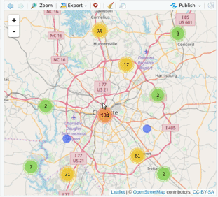
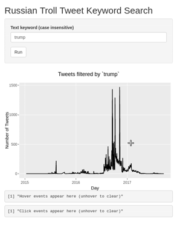
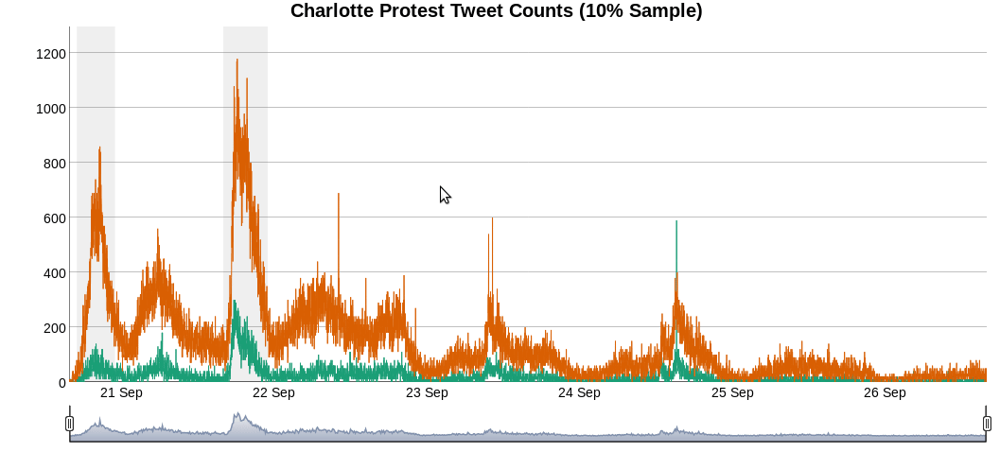

# Interactive Visualizations with RStudio

In this three-part workshop series, we’ll use RStudio tools like tidyverse, Shiny, and htmlwidgets to develop interactive visualizations. 

Beer Related Tweets        |  Russian Twitter Trolls   |
:-------------------------:|:-------------------------:|
  |  




## Sponsored by 

* [UNC Charlotte Data Science Initiative](https://dsi.uncc.edu/)

## Date, Time and Location

* July 18 (Part 1), July 25 (Part 2), and August 1 (Part 3) 

* 5:30 pm - 8:15 pm

* [Packard Place](https://www.packard.place/) Classroom 110M
 
## Instructor

* [Ryan Wesslen](http://wesslen.github.io)

## Workshop Overview

### Pre-workshop Work

Please read and complete the [workshop installation steps](#install).

**Optional**: Sign up for a free [DataCamp](https://www.datacamp.com/) account and complete these two courses: 

* [Introduction to the tidyverse](https://www.datacamp.com/courses/introduction-to-the-tidyverse) (only chapter 1; other chapters cost $)
* [Building Web Applications in R with Shiny](https://www.datacamp.com/courses/building-web-applications-in-r-with-shiny) (entire course is free!)

### Part 1: Intro to tidyverse and Shiny

We’ll introduce [**RStudio**](https://www.rstudio.com/products/RStudio/) along with [`tidyverse`](https://www.tidyverse.org/), a unified set of R packages for end-to-end data science. These packages include core data science workflow tools for data acquisition, processing and visualization. We’ll end with an introduction to [**Shiny**](http://shiny.rstudio.com/), an R package for building interactive web apps. Shiny apps are flexible web applications that can be embedded within web pages, dashboards, and [**RMarkdown**](https://rmarkdown.rstudio.com/) output like presentations or notebooks. 

| Day 1: Wed July 18  | Intro to tidyverse and Shiny |
| ------------------- | ------------------------------------------------------- |
| Welcome             | [PollEverywhere](https://pollev.com/ryanwesslen365), this GitHub Page & [RStudio.Cloud sign-up](#install) |
| Lecture             | [Introduction to Tidyverse](http://rpubs.com/ryanwesslen/rviz-tutorial-tidy) |
| Hands On Tutorial   | [Russian Twitter Trolls](./day1/01-russian-trolls.R) / [HTML](http://rpubs.com/ryanwesslen/rviz-tutorial-tidy2)   |
| Lecture   | [Introduction to Shiny](https://unccviscenter.shinyapps.io/intro-to-shiny/) |
| Hands On Tutorial   | [Shiny Hello World](./day1/app.R) and deploying to [shinyapps.io](http://shinyapps.io) |
| Help & Resources    | [How to ask for help](#help) |
| Home Assignment | [Day 1 Assignment](./day1/assignment.R) |

**Home assignment**

Use the Russian Twitter Troll data set to create a shiny app that queries on the keyword. The app should output the plotly-ggplot2 time series chart from [01-russian-trolls.R](./day1/01-russian-trolls.R). 

**Extra studying**

* [Shiny Basics Tutorial](http://shiny.rstudio.com/articles/basics.html)
* [Shiny Intermediate Tutorial](http://shiny.rstudio.com/articles/app-formats.html)
* [tidyverse learnR practice](./practice/day1/day1.Rmd)
* Chapters [3](http://r4ds.had.co.nz/data-visualisation.html), [5](http://r4ds.had.co.nz/transform.html), and [7](http://r4ds.had.co.nz/exploratory-data-analysis.html) of [R for Data Science](http://r4ds.had.co.nz)

### Part 2: Shiny and htmlwidgets

We’ll dive deeper into Shiny apps and review basic architecture, layouts, and reactivity with hands-on examples. We’ll also introduce [**htmlwidgets**](http://www.htmlwidgets.org/) (e.g., plotly, r2d3, leaflet), simple R packages for producing HTML-based interactive visualizations that can be extended with HTML, CSS, and JavaScript. In this part, we’ll visualize important aspects of social media data like social networks, unstructured text, and geospatial data.

| Day 2: Wed July 25  | Shiny and htmlwidgets    |
| ------------------- | ------------------------------------------------------- |
| Refresher & Warm-up | [PollEverywhere](https://pollev.com/ryanwesslen365) and [Part 1 Assignment]() |
| Lecture             | [Shiny Reactivity](./slides/shiny-reactivity.pdf) |
| Hands On Tutorial   | [Reactivity code](./day2/reactivity/)  |
| Help & Resources | [RMarkdown & Shiny References](#shiny) |
| Demo / Website   | [htmlwidgets](https://www.htmlwidgets.org/) |
| Hands On Tutorial   | [htmlwidget code](./day2/02-htmlwidgets.R) / [HTML](http://rpubs.com/ryanwesslen/iviz-workshop3)   |
| Home Assignment | [Project](./day2/assignment.R) |

**Home assignment**

Use one of the three project data sets to develop your own Shiny app. You can work individually or in groups of two.

You will have the opportunity to present your app next time in class (completely optional) in case you want my or classmates' feedback. I can also work with anyone who's interested in putting their code/app online (e.g., GitHub) to create your Data Science portfolio.

### Part 3: Advanced Shiny

We’ll consider more advanced layout templates like [shinydashboard](https://rstudio.github.io/shinydashboard/) to provide professional looking dashboard templates. We’ll also explore advanced Shiny functionality including interactions, persistent storage, and opimizing/scaling apps up (e.g., modular functions and async programming).

| Day 3: Wed Aug 1    | Advanced Shiny            |
| ------------------- | ------------------------------------------------------- |
| Warm-up             | [PollEverywhere](https://pollev.com/ryanwesslen365) |
| Lecture             | Templates [shinydashboard](./slides/shinydashboard.pdf) / [flexdashboard](./slides/flexdashboard.pdf) |
| Hands On Tutorial   | [flexdashboard](./day3/04-templates.R)   |
| Help & Resources | [Pulling Social Media Data](#data) |
| Lecture             | [Interactions, Persistent Storage, and In Production](./slides/03-shiny.pdf) |
| Present Projects | Students present their Shiny tools (optional). |

## <a name="install"></a> Workshop Instructions:

We'll use RStudio Cloud for the workshop. RStudio Cloud enables a collaborative workspace where participants can run pre-saved code. This avoids the headaches of everyone's unique machine set up.  

To get started, sign up for a free account [https://rstudio.cloud](https://rstudio.cloud/) (no need if you already have an account). If you already have a [shinyapps.io](https://shinyapps.io) account, you can use those credentials instead.

Students will be emailed the workshop link the week of the first workshop.

### Run R/RStudio Locally

The cloud is great for workshop materials; but it is limited to only 1GB of memory. That's why RStudio Cloud is best only for this workshop, not long term. 

For bigger projects, install R and RStudio locally so you can have the materials for your long-term research/work purposes. To install R/RStudio locally:

1. Download [R](http://archive.linux.duke.edu/cran/) and [R Studio](https://www.rstudio.com/products/rstudio/download/). 

2. Download this GitHub repo through the Download button or clone.

If you have Git setup on your computer, you can clone the repo into your current directory via terminal (command line):

```{bash}
git clone https://github.com/wesslen/iviz-rstudio-workshop.git
```

3. Open the file `project.Rproj` in RStudio. 

### Installing packages

To install the workshop's packages, run the file `00-install-packages.R`. It runs this code:

```{r}
packages <- c("tidyverse","plotly","shiny","leaflet","dygraphs","flexdashboard","ggridges","learnr",
              "xts","igraph","visNetwork","tidytext","collapsibleTree","shinydashboard","devtools",
              "digest","htmltools","htmlwidgets", "jsonlite","Rcpp","rstudioapi","yaml")

install.packages(packages)

# need ggplot2 for plotly
devtools::install_github('hadley/ggplot2')
devtools::install_github("rstudio/r2d3")
```

## Resources

### <a name="help"></a> Help! 

[This page is your best source for R help](https://wesslen.github.io/fall2017-rworkshops/help.html)

Please read if you run into R-relate problems.

### Tidyverse / Intro to R:

These resources are a best place to learn the basics. Traditionally, R was taught on the core (or "Base") R packages. More recently, tidyverse has become the modern approach to learning R.

I **highly** recommend [R for Data Science Book](http://r4ds.had.co.nz/) for anyone wanting to learn R (and applying Data Science).

You may also find these websites very helpful for each package:
* [Tidyverse](https://www.tidyverse.org/)
* [ggplot2](http://ggplot2.tidyverse.org/)
* [dplyr](http://dplyr.tidyverse.org/)
* [tidyr](http://tidyr.tidyverse.org/)
* [tidyquant](https://business-science.github.io/tidyquant/)
* [tidytext](https://www.tidytextmining.com/)
* [R Studio Community (for help)](https://community.rstudio.com/)

### DataCamp Tracks:

* [Data Manipulation for R Track](https://www.datacamp.com/tracks/data-manipulation-with-r)
* [Data Visualization for R Track](https://www.datacamp.com/tracks/data-visualization-with-r)
* [Statistics with R](https://www.datacamp.com/tracks/statistics-with-r)
* [Machine Learning in R](https://www.datacamp.com/tracks/machine-learning)

### RStudio Workshops & Webinars

RStudio::conf Workshops:

* [Amelia McNamera's Introduction to R & RStudio](https://github.com/AmeliaMN/IntroToR)
* [Charlotte Wickham's Data Science in Tidyverse](https://github.com/cwickham/data-science-in-tidyverse)
* [Mine Cetinkaya-Rundel's Intro to Shiny & RMarkdown](https://github.com/rstudio-education/intro-shiny-rmarkdown)
* [Joe Cheng & Dean Attali's Intermediate Shiny](https://github.com/jcheng5/shiny-training-rstudioconf-2018)

[Past R Studio Webinars](https://github.com/rstudio/webinars)

### <a name="shiny"></a> R Markdown / Shiny 

#### Shiny

* [Shiny (Interactive Visualizations)](http://shiny.rstudio.com/)
* [Shiny Gallery](http://shiny.rstudio.com/gallery/)
* [Tutorial (Basics)](http://shiny.rstudio.com/articles/basics.html)
* [Tutorial (Intermediate)](http://shiny.rstudio.com/articles/app-formats.html)
* [Tutorial (Deployment)](http://shiny.rstudio.com/articles/deployment-web.html)
* [Where to deploy test Shiny Apps](http://www.shinyapps.io/)
* [Tracking interactions](https://shiny.rstudio.com/articles/usage-metrics.html)
* [Bring Google Analytics data back into R](https://www.computerworld.com/article/2486018/business-intelligence/business-intelligence-how-to-extract-custom-data-from-the-google-analytics-api.html)

#### R Markdown

[R Markdown](http://rmarkdown.rstudio.com/) is an example of [literate programming](https://en.wikipedia.org/wiki/Literate_programming), i.e., code combined with plain language (as well as code output). The output can be an HTML, pdf, or even a Word document!

R Markdown can do nearly anything -- build a website, write a LaTeX paper for publication, even write a book! (For example, [R for Data Science](http://r4ds.had.co.nz/) is written in R Markdown. See the [GitHub](https://github.com/hadley/r4ds).)

* [Gallery](http://rmarkdown.rstudio.com/gallery.html)
* [Tutorial (Intro)](http://rmarkdown.rstudio.com/articles_intro.html)

[Flexdashboard](http://rmarkdown.rstudio.com/flexdashboard/)

* [Gallery](http://rmarkdown.rstudio.com/flexdashboard/examples.html)
* [Tutorial (Intro)](http://rmarkdown.rstudio.com/flexdashboard/using.html)
* [Tutorial (use with Shiny)](http://rmarkdown.rstudio.com/flexdashboard/shiny.html)

### <a name="data"></a>  Computational Social Science & Social Media Data

I've taught several past R workshops for text analysis, social media, and Computational Social Science.

* [Spring 2017 Workshop in Topic Modeling in R](https://github.com/wesslen/Topic-Modeling-Workshop-with-R)
* [Summer 2017 Social Media Workshop](https://github.com/wesslen/summer2017-socialmedia)
* [Fall 2017 Computational Social Science Workshop Series](https://wesslen.github.io/fall2017-rworkshops/)

#### Social Media Data Sources

* [Michael Kearney's rtweet package](http://rtweet.info)
* [Bob Rudis' rtweet cookbook](https://rud.is/books/21-recipes/)
* [Pablo Barbera's Rfacebook package](https://github.com/pablobarbera/Rfacebook)